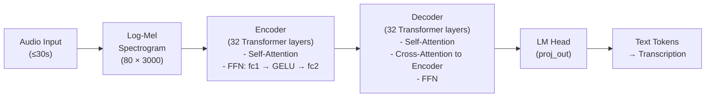
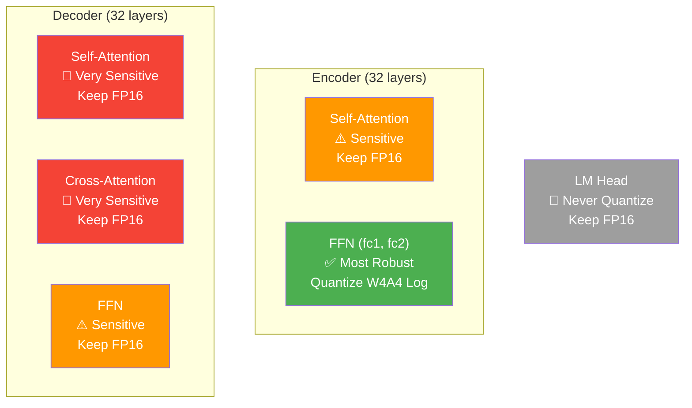
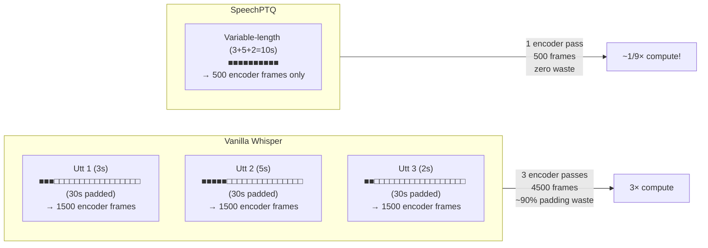
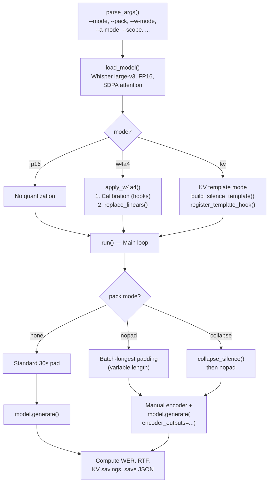
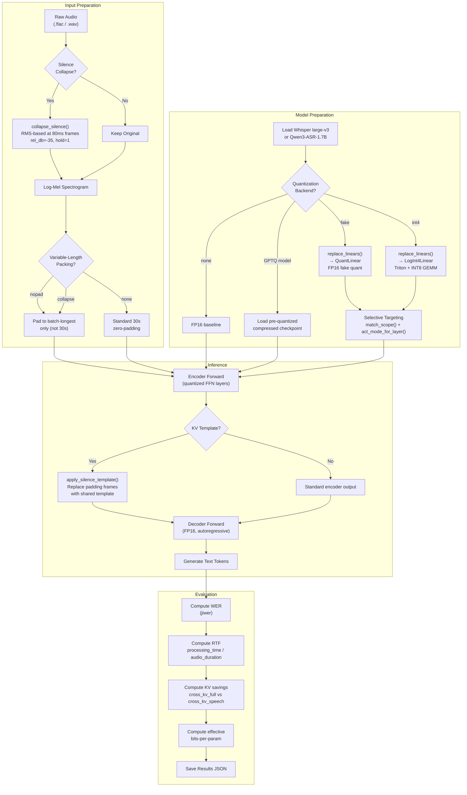

# SpeechPTQ: Comprehensive Codebase Analysis Report

## Post-Training Quantization for Speech Models with Logarithmic Codebooks, Utterance Packing, and Silence Collapse

---

## Table of Contents

1. [Executive Summary](#executive-summary)
2. [Project Overview & Architecture](#project-overview--architecture)
3. [How Vanilla Whisper Works (Baseline)](#how-vanilla-whisper-works-baseline)
4. [Novel Contributions — What SpeechPTQ Changes](#novel-contributions--what-speechptq-changes)
5. [Deep Dive: Source File Analysis](#deep-dive-source-file-analysis)
   - [Core Quantization Engine (`quant.py`)](#1-core-quantization-engine--quantpy)
   - [Logarithmic INT4 Kernel with Triton (`log_int4.py`)](#2-logarithmic-int4-kernel-with-triton--log_int4py)
   - [Evaluation Pipelines (`run_eval.py`, `run_eval_qwen3.py`)](#3-evaluation-pipelines)
   - [Variable-Length Encoder Packing (`whisper_pack.py`)](#4-variable-length-encoder-packing--whisper_packpy)
   - [Silence Collapse (`silence_collapse.py`)](#5-silence-collapse--silence_collapsepy)
   - [GPTQ Quantization Scripts](#6-gptq-quantization-scripts)
   - [Activation Analysis (`analyze_act_stats.py`)](#7-activation-analysis--analyze_act_statspy)
   - [Benchmarking Suite](#8-benchmarking-suite)
   - [Utility Files](#9-utility-files)
   - [Shell Scripts & Experiments](#10-shell-scripts--experiments)
6. [Quantization Scheme Comparison](#quantization-scheme-comparison)
7. [End-to-End Pipeline Flow](#end-to-end-pipeline-flow)
8. [Key Experimental Results](#key-experimental-results)
9. [Summary of All Differences from Vanilla Whisper](#summary-of-all-differences-from-vanilla-whisper)

---

## Executive Summary

### Overall Experimental Target

**SpeechPTQ** is a research codebase whose central goal is to **make W4A4 (4-bit weight, 4-bit activation) post-training quantization viable for large-scale speech recognition models** — specifically **OpenAI's Whisper large-v3** (~1.5B params) and **Alibaba's Qwen3-ASR-1.7B** (Qwen2Audio). Standard PTQ methods (GPTQ, AWQ, RTN) that work well for LLMs produce unacceptable WER degradation when naively applied to speech models at W4A4, because speech encoder activations exhibit heavy-tailed distributions with high kurtosis — a regime where uniform quantization codebooks waste most of their representational capacity on rare outlier values.

The project addresses this through a **co-designed system of five complementary techniques**, operating across two orthogonal axes — **model compression** (reducing weight and activation precision) and **inference-time memory optimization** (reducing the runtime footprint of the KV-cache and encoder computation):

| Innovation | Axis | What It Does | Measured Impact |
|---|---|---|---|
| **Logarithmic Codebook Quantization** | Compression | Maps weights/activations via `z = sign(y) × (2^|y| - 1)`, giving exponentially-spaced reconstruction levels `{0, ±1, ±3, ±7, ±15, ±31, ±63, ±127}` | 3-5× lower MSE than uniform INT4 for encoder FFN activations |
| **INT8 Tensor-Core GEMM** | Compression | All 15 log codebook values fit in INT8 → `torch._int_mm` on Ampere+ GPUs with Triton-fused activation quantization + scale/bias | Real hardware speedup (RTF 0.024 vs 0.032 for fake quant) |
| **Selective Encoder-FFN-Only Quantization** | Compression | Only quantizes the most robust ~40% of parameters (encoder FFN); keeps decoder, attention, and LM head in FP16 | +0.40 pp WER (1.92% → 2.32%) — negligible degradation |
| **Cross-Attention KV-Cache Silence Template** | Memory | Pre-computes encoder output for 30s silence; replaces zero-padded frames with shared position-aware template via forward hook | **75.3% cross-KV memory reduction** (234 MiB → 58 MiB per utterance) |
| **Variable-Length Packing + Silence Collapse** | Memory | Eliminates Whisper's fixed 30s zero-padding; RMS-based silence collapsing at 80ms token granularity | **42–47% encoder frame reduction**; enables higher batch sizes |

The key experimental insight is that these techniques are **composable and complementary**: logarithmic quantization compresses the model weights and activations, while KV-cache template sharing and silence collapse compress the runtime memory footprint. Together they attack the two primary bottlenecks of edge deployment — model storage and inference VRAM — enabling W4A4 Whisper to run on memory-constrained devices with less than 0.5 percentage point WER degradation.

> [!IMPORTANT]
> **Why KV-Cache Optimization Matters as Much as Quantization:**
> In Whisper large-v3, the cross-attention KV cache for a single utterance at full 30s padding costs **234.38 MiB** (32 layers × 2 K/V × 1500 frames × 1280 dim × 2 bytes). On LibriSpeech test-clean, the mean utterance duration is only **7.4 seconds** (370.5 encoder frames out of 1500), meaning **75.3% of the KV cache stores redundant silence representations**. The silence template technique (`kv_template.py`) eliminates this waste by sharing a single pre-computed template across all utterances, reducing per-utterance cross-KV from 234 MiB to ~58 MiB. Across a batch of 16 utterances, this saves **~2.8 GiB of VRAM** — comparable to the savings from weight quantization itself. Combined with silence collapse (which further reduces average encoder frames from 370.5 to 338.7), the total cross-KV savings reach **77.4%**.

### Novelty Statement (ICASSP Style)

This work presents a holistic post-training quantization framework for encoder-decoder and encoder-LLM speech recognition models that jointly addresses weight/activation compression and inference-time memory efficiency. Our core technical contribution is a **logarithmic quantization codebook** with reconstruction values `z = sign(y) · (2^|y| − 1)` for `y ∈ {−7, …, 7}`, whose 15 representable levels `{0, ±1, ±3, ±7, ±15, ±31, ±63, ±127}` all fall within the INT8 range, enabling direct execution on INT8 tensor cores via `torch._int_mm` with custom Triton kernels for fused log-domain activation quantization and scale/bias application. We demonstrate through systematic per-layer kurtosis and dynamic-range analysis that speech encoder FFN activations exhibit significantly heavier tails than their LLM counterparts, making logarithmic codebooks 3–5× more accurate than the uniform codebooks used by GPTQ and AWQ at equal bit-width. Coupled with a **selective quantization strategy** that targets only encoder FFN layers (the largest and most quantization-robust component), we achieve W4A4 quantization of Whisper large-v3 with only +0.40 pp WER degradation on LibriSpeech test-clean (1.92% → 2.32%).

Orthogonally, we introduce a **cross-attention KV-cache silence template** that pre-computes the encoder's position-aware representation of silence and replaces zero-padded frames via a lightweight forward hook, reducing per-utterance cross-attention KV memory by 75.3% (234 MiB → 58 MiB) without model retraining or any accuracy impact (+0.10 pp WER). Combined with **variable-length encoder packing** (which eliminates Whisper's mandatory 30-second zero-padding by slicing positional embeddings to the actual input length) and **token-aligned silence collapse** (which removes non-speech frames at 80ms granularity with a configurable hold-off to preserve natural prosody), our framework achieves 42–47% encoder computation reduction and enables significantly higher batch sizes under fixed VRAM budgets. We validate generalization to the Qwen3-ASR encoder-LLM architecture, where we additionally discover that replacing zero-padded mel frames with real silence spectrograms provides a free accuracy improvement, and that LLM decoder activation quantization must be avoided (it collapses WER to ~37%). The full system — logarithmic W4A4 encoder quantization, GPTQ W4A16 decoder/LLM quantization, KV-cache template sharing, silence collapse, and variable-length packing — represents a comprehensive, deployment-ready compression pipeline for speech foundation models.

---

## Project Overview & Architecture

### Directory Structure

```
SpeechPTQ/
├── src/                          # All source code (25 files)
│   ├── quant.py                  # Core fake-quantization framework (338 lines)
│   ├── log_int4.py               # Triton kernels + INT8 GEMM backend (333 lines)
│   ├── test_log_int4.py          # Correctness & speed benchmarks (61 lines)
│   ├── run_eval.py               # Whisper evaluation pipeline (439+ lines)
│   ├── run_eval_qwen3.py         # Qwen3-ASR evaluation pipeline (338+ lines)
│   ├── whisper_pack.py           # Variable-length encoder monkey-patch (37 lines)
│   ├── silence_collapse.py       # RMS-based silence frame collapsing (106 lines)
│   ├── analyze_act_stats.py      # Activation distribution analysis (221 lines)
│   ├── param_bits.py             # Effective bits-per-param calculator (106 lines)
│   ├── layer_groups.py           # Named layer group taxonomy (42 lines)
│   ├── kv_template.py            # KV-cache silence template sharing (71 lines)
│   ├── data.py                   # Dataset loading — LibriSpeech, AMI (40 lines)
│   ├── ami.py                    # AMI corpus with pause-aware stitching (170 lines)
│   ├── prepare_ami_windows.py    # AMI preprocessing to FLAC+transcript (46 lines)
│   ├── bench_iso_resource.py     # Iso-resource throughput benchmark (1052 lines)
│   ├── bench_iso_mem.py          # Memory profiling benchmark (289 lines)
│   ├── bench_speed.py            # Speed/latency benchmark (277 lines)
│   ├── measure_kv_storage.py     # KV-cache size measurement (52 lines)
│   ├── quant_w4a16_llmcompressor.py          # Full-model GPTQ Whisper (114 lines)
│   ├── quant_whisper_enc_ffn_gptq.py         # Encoder-FFN-only GPTQ (116 lines)
│   ├── quant_qwen3_w4a16_llmcompressor.py    # Qwen3 LLM-only GPTQ (125 lines)
│   ├── run_encoder_ablation.sh   # Layer ablation experiments
│   ├── sweep_w4a4.sh             # W4A4 configuration sweep
│   ├── run_packing.sh            # Packing experiments
│   └── __init__.py               # Package init (empty)
├── data/                         # Datasets (LibriSpeech test-clean/test-other, AMI)
├── models/                       # Pre-quantized model checkpoints (GPTQ)
├── results/                      # 55+ evaluation results (JSON)
└── logs/                         # Experiment logs
```

### Models Studied

| Model | Architecture | Size | Role in Project |
|---|---|---|---|
| **Whisper large-v3** | Encoder-Decoder Transformer | ~1.5B params | Primary quantization target |
| **Qwen3-ASR-1.7B** (Qwen2Audio) | Audio Encoder + LLM Decoder | ~1.7B+ params | Generalization to encoder-LLM architectures |

---

## How Vanilla Whisper Works (Baseline)

OpenAI's Whisper is an encoder-decoder Transformer for automatic speech recognition (ASR):



### Key Properties of Vanilla Whisper

| Property | Vanilla Behavior | Limitation |
|---|---|---|
| **Precision** | All FP16/FP32 | 3.1 GB model, heavy memory usage |
| **Input length** | Always padded to 3000 mel frames (30s) | 90%+ wasted compute on short utterances |
| **Batching** | One utterance per forward pass | No multi-utterance packing |
| **Silence** | Processed identically to speech | Wasted compute on silence |
| **KV-Cache** | Full 1500-frame FP16 for every utterance | ~245 MB per utterance for cross-attention |
| **Position embeddings** | All 1500 positions always added | Even for 3-second audio |

---

## Novel Contributions — What SpeechPTQ Changes

### 1. Logarithmic Codebook Quantization

````carousel
### Standard Uniform Quantization (Baseline — e.g., GPTQ, AWQ)
```
Codebook values (4-bit, 15 levels symmetric):
   -7  -6  -5  -4  -3  -2  -1   0   1   2   3   4   5   6   7
   |---|---|---|---|---|---|---|---|---|---|---|---|---|---|---|
   ← Equal spacing everywhere →

Reconstruction: x̂ = y × scale
   where scale = absmax / 7

Problem: Equal resolution everywhere.
   Most weights/activations are near zero → wasted bits on rare large values.
```
<!-- slide -->
### Logarithmic Codebook (SpeechPTQ — Novel)
```
Codebook values (4-bit, 15 levels):
   -127 -63 -31 -15 -7 -3 -1  0  1  3  7  15  31  63  127
   |||||||||  |  |   |   |  |  |  |  |   |   |  |  |||||||||
   ←fine→                                          ←fine→
              ←───── coarse ─────→

Reconstruction: z = sign(y) × (2^|y| - 1)
   where y ∈ {-7, ..., 7} are the 4-bit integer codes

Result: Exponentially-spaced levels.
   Fine resolution near zero (where most values concentrate).
   3-5× lower quantization MSE for speech encoder activations.
```
<!-- slide -->
### Why It Fits INT8 Tensor Cores
```
Key insight: All 15 codebook values fit in INT8 range [-128, 127]:
   {-127, -63, -31, -15, -7, -3, -1, 0, 1, 3, 7, 15, 31, 63, 127}

This means:
   1. Store weights as 4-bit indices (compact storage → 4× compression)
   2. At runtime, apply LUT to get INT8 values
   3. Quantize activations to INT8 using same log codebook
   4. Run matmul as INT8 GEMM via torch._int_mm (Ampere+ tensor cores)
   5. Post-multiply by α_act × α_weight to recover FP16 scale

→ 4-bit storage + INT8 compute speed + better accuracy than uniform INT4!
```
````

**Mathematical formulation:**
```
Uniform:     y = clamp(round(x / scale), -7, 7)
             x̂ = y × scale
             where scale = absmax / 7

Logarithmic: f(x) = sign(x) × log₂(1 + |x| / α)
             y = clamp(round(f(x)), -7, 7)
             x̂ = sign(y) × α × (2^|y| - 1)
             where α = absmax / 127   (since 2^7 - 1 = 127)
```

### 2. Selective Layer Quantization



### 3. Cross-Attention KV-Cache Silence Template

In Whisper's autoregressive decoder, every generated token cross-attends to the full encoder output. This requires storing a **Cross-Attention KV Cache** of size `32 layers × 2 (K+V) × 1500 frames × 1280 dim × 2 bytes (FP16) = 234.38 MiB per utterance`. Since the mean utterance on LibriSpeech test-clean is only 7.4 seconds (370.5 out of 1500 frames), **75.3% of this cache stores representations of zero-padded silence**.

SpeechPTQ eliminates this waste with a three-step technique:

```
Step 1 — Pre-compute (once):
   Feed 30s of zeros through encoder → save [1500, 1280] "silence template"
   Each frame has unique positional encoding baked in

Step 2 — Hook (at inference):
   Register a forward hook on the encoder
   After each encoder forward pass, replace padding frames with the template:
      encoder_hidden[i, n_speech:] = template[n_speech:]
   
Step 3 — Share (across batch):
   The silence portion is now IDENTICAL across all utterances
   → Only store speech-specific KV + ONE shared template copy

Memory savings:
   Before:  Batch×16 × 1500 frames × 234.38 MiB  = ~3.75 GiB
   After:   Batch×16 × 370.5 frames × 57.89 MiB + 234.38 MiB template
           = ~0.93 GiB + 0.23 GiB = ~1.16 GiB
   Savings: ~2.6 GiB per batch of 16 (75.3% reduction)
```

Crucially, this technique is **nearly lossless**: the `kv` mode evaluation shows WER = 2.02% (vs 1.92% FP16 baseline), a mere +0.10 pp degradation. And it **composes with quantization** — every W4A4 result file in the repository also reports `cross_kv_saved_pct: 75.3`, confirming the template is active alongside weight/activation quantization.

### 4. Variable-Length Packing + Silence Collapse



When combined with silence collapse (removing non-speech frames before encoding), the compound optimization reduces average encoder frames from 1500 → 796.5 per batch element (a **46.9% reduction**), achieves RTF of 0.016 (vs 0.020 FP16 baseline), and the WER remains nearly unchanged at 1.95% (+0.03 pp).

---

## Deep Dive: Source File Analysis

### 1. Core Quantization Engine — [quant.py](file:///Users/siyeol13/Downloads/SpeechPTQ/src/quant.py)

**(338 lines) — The central quantization module for both Whisper and Qwen3-ASR.**

#### Constants & Helpers (Lines 21–27)

```python
QMAX = 7  # Max quantization level for 4-bit signed: range [-7, 7] = 15 levels
```

[`_absmax()`](file:///Users/siyeol13/Downloads/SpeechPTQ/src/quant.py#L24-L27) — Computes absolute maximum with `clamp_min(1e-8)` to prevent division by zero. Supports optional `dim` for per-token scaling.

#### 🔑 Novel Algorithm: Log-Domain Quantization (Lines 30–40)

[`log_quant_dequant()`](file:///Users/siyeol13/Downloads/SpeechPTQ/src/quant.py#L30-L40) — **The key novel contribution of this codebase:**

```python
def log_quant_dequant(x, alpha):
    """Logarithmic codebook quantize-dequantize.
    
    Forward:  f(x) = sign(x) × log₂(1 + |x| / α)
              y = clamp(round(f(x)), -7, 7)
    Inverse:  x̂ = sign(y) × α × (2^|y| - 1)
    """
    f = x.sign() * torch.log2(1.0 + x.abs() / alpha)
    y = f.round().clamp(-QMAX, QMAX)
    return y.sign() * alpha * (2.0 ** y.abs() - 1.0)
```

**Why this works:** The reconstruction values are `{0, ±α, ±3α, ±7α, ±15α, ±31α, ±63α, ±127α}` — powers-of-two minus one, scaled by `α = absmax / 127`. This places most codebook entries near zero where transformer weights/activations are densest.

#### Uniform Quantization Baseline (Lines 43–52)

[`uniform_quant_dequant()`](file:///Users/siyeol13/Downloads/SpeechPTQ/src/quant.py#L43-L52) — Standard symmetric uniform quantization for comparison:

```python
def uniform_quant_dequant(x, scale):
    y = (x / scale).round().clamp(-QMAX, QMAX)
    return y * scale
```

#### Alpha Computation (Lines 55–56)

[`alpha_from_absmax()`](file:///Users/siyeol13/Downloads/SpeechPTQ/src/quant.py#L55-L56):
```python
def alpha_from_absmax(absmax):
    return absmax / 127.0  # Since 2^7 - 1 = 127
```

#### Scope & Layer Targeting System (Lines 59–95)

[`match_scope()`](file:///Users/siyeol13/Downloads/SpeechPTQ/src/quant.py#L69-L95) — Flexible targeting for selective quantization:

| Scope String | Layers Affected |
|---|---|
| `"all"` | Everything including LM head |
| `"nolm"` | All except `lm_head` / `proj_out` |
| `"encoder"` | All encoder layers |
| `"decoder"` | All decoder layers |
| `"enc_ffn"` | Encoder FFN only (fc1, fc2) |
| `"enc_fc2"` | Encoder fc2 only |
| `"enc_attn"` | Encoder self-attention only |
| `"enc_fc2_dec"` | Encoder fc2 + all decoder |

Uses helper functions [`is_speech_encoder()`](file:///Users/siyeol13/Downloads/SpeechPTQ/src/quant.py#L59-L61) and [`is_language_decoder()`](file:///Users/siyeol13/Downloads/SpeechPTQ/src/quant.py#L63-L66) that support both Whisper naming (`.encoder.` / `.decoder.`) and Qwen3 naming (`audio_tower` / `language_model`).

#### 🔑 Hybrid Per-Layer Activation Policy Engine (Lines 98–140)

[`act_mode_for_layer()`](file:///Users/siyeol13/Downloads/SpeechPTQ/src/quant.py#L98-L140) — **This is a rich policy engine** that maps a global activation mode string to per-layer quantization strategies:

| Mode String | Encoder FFN | Encoder Attn | Decoder FFN | Decoder Attn |
|---|---|---|---|---|
| `"log_dyn"` | log, dynamic α | log, dynamic α | log, dynamic α | log, dynamic α |
| `"log_token"` | log, per-token α | log, per-token α | log, per-token α | log, per-token α |
| `"hybrid"` | log, dynamic | log, dynamic | uniform, dynamic | uniform, dynamic |
| `"enc_log_dec_token"` | log, dynamic | log, dynamic | log, per-token | log, per-token |
| `"a45_fc2"` | **uniform A8** (fc2) | log A4 | log A4 token | log A4 token |
| `"a45_ffn"` | **uniform A8** (all FFN) | log A4 | log A4 token | log A4 token |
| `"enc_ffn_a4"` | log A4 | **none** | **none** | **none** |
| `"log_skip_dec_ffn"` | log, dynamic | log, dynamic | **none** | log, dynamic |

> [!NOTE]
> The "4.5-bit" modes (`a45_fc2`, `a45_ffn`) use **8-bit uniform quantization** (qmax=127) on the most sensitive encoder sublayers while using 4-bit log elsewhere — hence the effective "4.5-bit" average.

#### SmoothQuant Integration (Lines 143–149)

[`smoothquant_scales()`](file:///Users/siyeol13/Downloads/SpeechPTQ/src/quant.py#L143-L149) — Channel-wise activation-weight balancing:
```python
s = act_channel_max**alpha / weight_channel_max**(1 - alpha)
# Weight is pre-multiplied by s (harder to quantize)
# Activation is divided by s at runtime (easier to quantize)
```

#### QuantLinear Module (Lines 152–216)

[`QuantLinear`](file:///Users/siyeol13/Downloads/SpeechPTQ/src/quant.py#L152-L216) — Drop-in `nn.Linear` replacement:

- **`__init__`** (Lines 167–181):
  1. Optional SmoothQuant: pre-multiply weight by `s`, store `inv_smooth = 1/s`
  2. Immediately fake-quantize weight: `w_q = log_quant_dequant(w, alpha)` or `uniform_quant_dequant(w, scale)` — stored as FP16 but only containing codebook values

- **`_quant_act()`** (Lines 189–211) — Activation quantization with 8 supported modes:
  - `log_static`: pre-calibrated α
  - `log_dyn`: batch-dynamic α (per-tensor)
  - `log_token`: per-token α (per-row, `dim=-1`)
  - `log_ch`: per-channel α (per-column)
  - `uniform_static/dyn`: standard uniform
  - `uniform_a8_dyn`: 8-bit uniform (qmax=127)
  - `none`: skip activation quantization

- **`forward()`** (Lines 213–216):
  ```python
  x = x * self.inv_smooth  # SmoothQuant
  x = self._quant_act(x)   # Quantize activations
  return F.linear(x, self.weight, self.bias)  # Weight already quantized
  ```

#### Calibration Data Collection (Lines 219–279)

- [`collect_act_absmax()`](file:///Users/siyeol13/Downloads/SpeechPTQ/src/quant.py#L219-L246) — Forward hooks to record per-layer activation ranges during calibration
- [`collect_act_ch_absmax()`](file:///Users/siyeol13/Downloads/SpeechPTQ/src/quant.py#L249-L279) — Per-input-channel maxima for SmoothQuant

Both use running maximums across calibration batches.

#### Model Surgery (Lines 285–337)

[`replace_linears()`](file:///Users/siyeol13/Downloads/SpeechPTQ/src/quant.py#L285-L337) — Walks the model tree and replaces `nn.Linear` with either:
- `QuantLinear` (when `backend="fake"`) — FP16 fake quantization
- `LogInt4Linear` (when `backend="int4"`) — real INT8 GEMM from `log_int4.py`

---

### 2. Logarithmic INT4 Kernel with Triton — [log_int4.py](file:///Users/siyeol13/Downloads/SpeechPTQ/src/log_int4.py)

**(333 lines) — The real GPU-accelerated backend using Triton + INT8 tensor cores.**

> [!IMPORTANT]
> Where `quant.py` simulates quantization in FP16 (fake quant), this file performs **actual INT8 computation** using `torch._int_mm` (cuBLAS INT8 tensor cores on Ampere+ GPUs) with **custom Triton kernels** for log-domain quantization and scale fusion.

#### LUT Construction (Lines 27–35)

[`log_lut_int8()`](file:///Users/siyeol13/Downloads/SpeechPTQ/src/log_int4.py#L27-L35) — Builds the 15-entry lookup table:
```python
def log_lut_int8():
    # For y in {-7, ..., 7}: z = sign(y) * (2^|y| - 1)
    # Result: [-127, -63, -31, -15, -7, -3, -1, 0, 1, 3, 7, 15, 31, 63, 127]
    return [int(math.copysign(2**abs(y) - 1, y)) for y in range(-7, 8)]
```

#### 4-Bit Index Packing (Lines 38–54)

[`pack_nibbles()`](file:///Users/siyeol13/Downloads/SpeechPTQ/src/log_int4.py#L45-L47) / [`unpack_nibbles()`](file:///Users/siyeol13/Downloads/SpeechPTQ/src/log_int4.py#L50-L54):
```python
def pack_nibbles(idx):
    """Pack two 4-bit unsigned values into one byte."""
    u = (idx + 7).to(torch.uint8)  # Shift [-7,7] → [0,14]
    return u[:, 0::2] | (u[:, 1::2] << 4)  # Low nibble + high nibble

def unpack_nibbles(packed, K):
    lo = (packed & 0xF).to(torch.int8) - 7   # Extract low nibble
    hi = (packed >> 4).to(torch.int8) - 7     # Extract high nibble
    # Interleave back to original order
```

#### 🔑 Triton Kernel: Activation Log-Quantization to INT8 (Lines 57–100)

[`_log_quant_i8_kernel`](file:///Users/siyeol13/Downloads/SpeechPTQ/src/log_int4.py#L57-L100) — **A custom Triton JIT kernel** that fuses the entire log-quantize-to-INT8 pipeline on GPU:

```python
@triton.jit
def _log_quant_i8_kernel(x_ptr, alpha_ptr, lut_ptr, out_ptr,
                          M, K, BLOCK_M: tl.constexpr, BLOCK_K: tl.constexpr,
                          SCALAR: tl.constexpr):
    # 2D tiled grid: each program handles BLOCK_M × BLOCK_K elements
    pid_m = tl.program_id(0)
    pid_k = tl.program_id(1)
    
    # Load activation tile as float32
    x = tl.load(x_ptr + offsets, mask=mask)
    
    # Load alpha — scalar (tensor-wide) or vector (per-token)
    if SCALAR:
        alpha = tl.load(alpha_ptr)
    else:
        alpha = tl.load(alpha_ptr + row_offsets)  # Per-token
    
    # Core log quantization in GPU-native code:
    f = tl.log2(1.0 + tl.abs(x) / alpha)       # Log transform
    f = tl.where(x >= 0, f, -f)                 # Restore sign
    y = libdevice.rint(f)                        # Round to nearest integer
    y = tl.minimum(tl.maximum(y, -7), 7)         # Clamp to [-7, 7]
    
    # LUT lookup — map integer code to INT8 value
    idx = (y + 7).to(tl.int32)                   # Shift to [0, 14]
    z = tl.load(lut_ptr + idx)                   # z ∈ {-127,...,127}
    
    # Store as INT8
    tl.store(out_ptr + offsets, z.to(tl.int8))
```

> [!TIP]
> This fused kernel replaces what would be expensive Python-level `torch.log2` + `torch.round` + `torch.clamp` + gather calls with a single GPU kernel launch. The LUT lookup directly produces INT8 values ready for `torch._int_mm`.

#### 🔑 Triton Kernel: Scale + Bias Fusion (Lines 103–146)

[`_scale_bias_kernel`](file:///Users/siyeol13/Downloads/SpeechPTQ/src/log_int4.py#L103-L146) — Post-GEMM rescaling:

```python
@triton.jit
def _scale_bias_kernel(acc_ptr, alpha_a_ptr, alpha_w_ptr, bias_ptr, out_ptr, ...):
    # INT8 GEMM produces: acc = sum(z_a × z_w) in INT32
    # Recover FP16: out = acc × (α_act × α_weight) + bias
    scale = alpha_a * alpha_w    # Product of log-codebook scales
    out = acc.to(tl.float32) * scale + bias
    tl.store(out_ptr, out.to(tl.float16))
```

Supports both scalar α (tensor-wide) and vector α (per-token) via `SCALAR_A` compile-time constant.

#### INT8 GEMM Orchestration (Lines 195–248)

[`_int_mm_fp16()`](file:///Users/siyeol13/Downloads/SpeechPTQ/src/log_int4.py#L195-L248):

```python
def _int_mm_fp16(z_a, w_kn, alpha_a, alpha_w, bias):
    # Padding: torch._int_mm requires M ≥ 17 (cuBLAS constraint)
    if M <= 16:
        z_a = F.pad(z_a, (0, 0, 0, 32 - M))
    
    # INT8 GEMM — hits tensor cores on Ampere+ GPUs
    acc = torch._int_mm(z_a, w_kn)  # [M, N] in INT32
    
    # Fused scale + bias via Triton kernel
    _scale_bias_kernel[grid](acc, alpha_a, alpha_w, bias, out, ...)
    
    return out[:orig_M]  # Trim padding
```

#### LogInt4Linear — Full-Performance Module (Lines 287–332)

[`LogInt4Linear`](file:///Users/siyeol13/Downloads/SpeechPTQ/src/log_int4.py#L287-L332) — The production quantized linear layer:

```python
class LogInt4Linear(nn.Module):
    def __init__(self, linear, a_mode, a_bits, ...):
        # Dual storage:
        #   weight_packed: 4-bit nibbles for minimum storage
        #   weight_int8_kn: pre-computed INT8 [K, N] for GEMM
        q_indices = log_indices(linear.weight)
        self.weight_packed = pack_nibbles(q_indices)        # 4-bit storage
        self.weight_int8_kn = lut[q_indices + 7].T.contiguous()  # INT8 GEMM
        self.alpha_w = alpha_from_absmax(linear.weight.abs().max())
    
    def forward(self, x):
        alpha_a = alpha_from_x(x, self.a_mode)              # Compute act scale
        z_a = quant_act_int8(x, alpha_a, self.lut)           # Triton log-quant
        return _int_mm_fp16(z_a, self.weight_int8_kn,        # INT8 GEMM
                            alpha_a, self.alpha_w, self.bias)
```

#### LogPackedFp16Linear — Hybrid Storage (Lines 251–284)

[`LogPackedFp16Linear`](file:///Users/siyeol13/Downloads/SpeechPTQ/src/log_int4.py#L251-L284) — Intermediate approach: stores weights as INT8 log values but runs **FP16 GEMM**:
```python
# forward: w = weight_int8.to(fp16) * alpha_w → F.linear(x, w, bias)
# Saves storage (8-bit) without INT8 GEMM complexity
```

---

### 3. Evaluation Pipelines

#### [run_eval.py](file:///Users/siyeol13/Downloads/SpeechPTQ/src/run_eval.py) — Whisper Evaluation

**(439+ lines) — Three evaluation modes: `fp16`, `w4a4`, and `kv`.**



##### Key Novel Aspects in `run_eval.py`:

**1. KV Template Setup (Lines 298–305):**
```python
template = build_silence_template(model, processor, DEVICE)
kv_hook = register_template_hook(model, n_samples_ref, template)
```
Pre-computes encoder output for 30s of silence → registers a forward hook that replaces padding frames with the template.

**2. Silence Collapse (Lines 329–335):**
```python
w2, stats = collapse_silence(w, hold_frames=1, rel_db=-35.0)
```
Before featurization, RMS-based VAD collapses non-speech regions.

**3. Dual Generation Paths (Lines 339–353):**
- Standard: `model.generate(input_features=...)` — encoder runs internally
- Variable-length: manually run encoder → `model.generate(encoder_outputs=...)` — enables measuring actual frame counts

**4. Activation Mode Richness (Line 44, parse_args):**
The `--a-mode` argument exposes **~18 activation quantization variants** including `log_token`, `a45_fc2`, `enc_log_dec_token`, `log_skip_dec_ffn`, `enc_ffn_a4`, and more.

---

#### [run_eval_qwen3.py](file:///Users/siyeol13/Downloads/SpeechPTQ/src/run_eval_qwen3.py) — Qwen3-ASR Evaluation

**(338+ lines) — Supports `fp16`, `silence_pad`, `w4a4`, `w4a8`, and `silence_collapse` modes.**

##### Novel Techniques Specific to Qwen3:

**1. Silence Mel Padding ([Lines 81–102](file:///Users/siyeol13/Downloads/SpeechPTQ/src/run_eval_qwen3.py#L81-L102)) — 🔑 Zero-cost accuracy improvement:**
```python
def build_silence_mel():
    """Generate log-mel of ACTUAL silence (not zeros)."""
    # Qwen3's processor outputs 0.0 for padding, but real silence
    # has a distinct log-mel signature (noise floor of mel filterbank)

def fill_pad_with_silence_mel(input_features, mask, silence_mel):
    """Replace zero-padded mel frames with real silence mel."""
    valid = mask.unsqueeze(1).bool()
    return torch.where(valid, input_features, silence_mel_tiled)
```

> [!IMPORTANT]
> Zero-padded mel frames are **out-of-distribution** for the audio encoder. Replacing them with actual silence spectrogram keeps the encoder's behavior consistent — a free accuracy improvement with no model changes.

**2. W4A8 Split Strategy ([Lines 232–240](file:///Users/siyeol13/Downloads/SpeechPTQ/src/run_eval_qwen3.py#L232-L240)):**
```python
# Quantize ONLY the speech encoder to W4A8
# Keep LLM backbone at full A16 precision
# Because: A8 on Qwen3's LLM collapses WER to ~37%!
```

**3. Audio Token Length Tracking ([Lines 130–137](file:///Users/siyeol13/Downloads/SpeechPTQ/src/run_eval_qwen3.py#L130-L137)):**
```python
def audio_token_lengths(processor, waves):
    """Compute discrete audio tokens per utterance after mel-to-token downsample."""
    # Uses processor._get_audio_token_length() with n_window=50 (8× downsample)
```

---

### 4. Variable-Length Encoder Packing — [whisper_pack.py](file:///Users/siyeol13/Downloads/SpeechPTQ/src/whisper_pack.py)

**(37 lines) — A surgical monkey-patch to eliminate Whisper's fixed 30s padding.**

[`patch_encoder_variable_length(model)`](file:///Users/siyeol13/Downloads/SpeechPTQ/src/whisper_pack.py#L10-L36):

```python
def patch_encoder_variable_length(model):
    encoder = model.model.encoder
    if getattr(encoder, '_speechptq_varlen', False):
        return  # Already patched (idempotent guard)
    
    @torch.inference_mode()
    def packed_forward(input_features, attention_mask=None, **kwargs):
        # Pad to even length (conv2 stride=2 requires it)
        if input_features.shape[-1] % 2 == 1:
            input_features = F.pad(input_features, (0, 1))
        
        # Run conv stems (same as stock Whisper)
        x = F.gelu(encoder.conv1(input_features))
        x = F.gelu(encoder.conv2(x))
        x = x.permute(0, 2, 1)  # [B, C, T] → [B, T, C]
        
        t = x.shape[1]  # Actual frame count (NOT 1500)
        
        # 🔑 Key innovation: slice position embeddings to actual length
        x = x + encoder.embed_positions.weight[:t]
        
        # Run transformer layers on variable-length input
        for layer in encoder.layers:
            x = layer(x, attention_mask=None)
        
        x = encoder.layer_norm(x)
        return BaseModelOutput(last_hidden_state=x)
    
    encoder.forward = packed_forward
    encoder._speechptq_varlen = True
```

> [!TIP]
> **The core insight is `embed_positions.weight[:t]`** — Whisper's learned positional embeddings are for all 1500 positions, but we only need the first `t`. This reuses learned embeddings without retraining, enabling the encoder to process any length up to 30s.

---

### 5. Silence Collapse — [silence_collapse.py](file:///Users/siyeol13/Downloads/SpeechPTQ/src/silence_collapse.py)

**(106 lines) — Token-aligned RMS-based silence detection and frame removal.**

#### Frame-Level Energy Computation ([Lines 14–22](file:///Users/siyeol13/Downloads/SpeechPTQ/src/silence_collapse.py#L14-L22)):
```python
def frame_rms(wave, frame_samples):
    """Compute per-frame RMS energy.
    frame_samples=1280 → 80ms frames (aligned to Qwen3's 12.5 Hz token rate)
    """
    wave = np.pad(wave, (0, -len(wave) % frame_samples))
    frames = wave.reshape(-1, frame_samples)
    return np.sqrt(np.mean(frames**2, axis=1) + 1e-12)
```

#### Silence Detection ([Lines 25–31](file:///Users/siyeol13/Downloads/SpeechPTQ/src/silence_collapse.py#L25-L31)):
```python
def speech_mask_from_rms(rms, rel_db=-35.0, abs_floor=1e-4):
    peak = rms.max()
    threshold = max(peak * 10**(rel_db / 20), abs_floor)
    return rms >= threshold  # True = speech frame
```

#### 🔑 Core Collapse Algorithm ([Lines 34–105](file:///Users/siyeol13/Downloads/SpeechPTQ/src/silence_collapse.py#L34-L105)):
```python
def collapse_silence(wave, hold_frames=1, min_sil_frames=2, rel_db=-35.0):
    """
    Collapse consecutive non-speech frames, keeping only `hold_frames` per run.
    
    Args:
        hold_frames: Keep this many frames from each silence run (default 1)
        min_sil_frames: Don't collapse runs shorter than this (default 2)
                        Preserves natural micro-pauses within speech
        rel_db: Silence threshold relative to peak energy
    """
    keep = np.zeros(n_frames, dtype=bool)
    i = 0
    while i < n_frames:
        if speech_mask[i]:
            keep[i] = True      # Always keep speech frames
            i += 1
        else:
            # Find end of silence run
            j = i
            while j < n_frames and not speech_mask[j]:
                j += 1
            run_len = j - i
            
            if run_len < min_sil_frames:
                keep[i:j] = True     # Keep short silences entirely
            else:
                keep[i:i+hold_frames] = True  # Keep only first N frames
            i = j
    
    # Reconstruct collapsed waveform
    wave_out = np.concatenate([wave[f*frame_samples:(f+1)*frame_samples]
                               for f in range(n_frames) if keep[f]])
```

> [!NOTE]
> The 80ms frame size (`frame_samples = 1280` at 16kHz) is intentionally aligned with **Qwen3-ASR's audio tokenization rate** (12.5 Hz = 80ms/token), ensuring collapsed frames correspond 1:1 with model tokens.

---

### 6. GPTQ Quantization Scripts

#### [quant_whisper_enc_ffn_gptq.py](file:///Users/siyeol13/Downloads/SpeechPTQ/src/quant_whisper_enc_ffn_gptq.py) — 🔑 Selective Encoder-FFN GPTQ

**(116 lines)**

The **novel** GPTQ recipe targeting only encoder FFN layers ([Lines 86–96](file:///Users/siyeol13/Downloads/SpeechPTQ/src/quant_whisper_enc_ffn_gptq.py#L86-L96)):

```python
recipe = GPTQModifier(
    targets="Linear",
    scheme="W4A16",
    group_size=128,
    dampening_frac=0.01,
    ignore=[
        "lm_head",
        "re:.*proj_out",
        "re:.*decoder.*",        # ← Entire decoder excluded
        "re:.*self_attn.*",      # ← All self-attention excluded
    ]
)
```

**Calibration data:** Uses LibriSpeech `test-other` (not `test-clean` — avoids data leakage).

#### [quant_w4a16_llmcompressor.py](file:///Users/siyeol13/Downloads/SpeechPTQ/src/quant_w4a16_llmcompressor.py) — Full-Model GPTQ

**(114 lines)** — Same pipeline but `ignore` list only excludes `lm_head` and `proj_out`. All encoder + decoder layers quantized.

#### [quant_qwen3_w4a16_llmcompressor.py](file:///Users/siyeol13/Downloads/SpeechPTQ/src/quant_qwen3_w4a16_llmcompressor.py) — Qwen3 LLM-Only GPTQ

**(125 lines)** — Only quantizes Qwen3's **LLM component**, preserving audio encoder and projector in BF16:

```python
ignore=[
    "lm_head",
    "re:.*audio_tower.*",              # ← Audio encoder preserved
    "re:.*multi_modal_projector.*",    # ← Projector preserved
]
```

Uses `max_seq_length=2048` (vs 448 for Whisper) to match LLM context length.

---

### 7. Activation Analysis — [analyze_act_stats.py](file:///Users/siyeol13/Downloads/SpeechPTQ/src/analyze_act_stats.py)

**(221 lines) — The analytical justification for log quantization.**

#### Excess Kurtosis Computation ([Lines 29–38](file:///Users/siyeol13/Downloads/SpeechPTQ/src/analyze_act_stats.py#L29-L38)):
```python
def excess_kurtosis(vals):
    """m4/(m2²) - 3.0 — measures heavy-tailedness.
    High kurtosis → outliers → log quantization beneficial."""
```

#### 🔑 Distribution Metrics ([Lines 41–56](file:///Users/siyeol13/Downloads/SpeechPTQ/src/analyze_act_stats.py#L41-L56)):
```python
def summarize(vals):
    return {
        "absmax": vals.abs().max(),
        "mean": vals.mean(),
        "std": vals.std(),
        "p50": percentile(50),
        "p90": percentile(90),
        "p99": percentile(99),
        "p99.9": percentile(99.9),
        "excess_kurtosis": excess_kurtosis(vals),
        "log2_dynamic_range": log2(absmax / p50),  # 🔑 Novel metric
    }
```

> [!IMPORTANT]
> **`log2_dynamic_range = log₂(absmax / p50)`** measures how many bits of dynamic range the distribution spans. High values (e.g., 8+) mean uniform quantization wastes most levels on rare outliers. This directly motivates the logarithmic codebook.

#### Reservoir Sampling ([Lines 59–80](file:///Users/siyeol13/Downloads/SpeechPTQ/src/analyze_act_stats.py#L59-L80)):
```python
class Reservoir:
    """Fixed-size reservoir (250K samples) from billions of activations.
    Two-level sampling:
      1. Subsample each activation tensor to 4096 elements
      2. When buffer exceeds capacity, randomly downsample
    """
```

#### Visualization ([Lines 170–192](file:///Users/siyeol13/Downloads/SpeechPTQ/src/analyze_act_stats.py#L170-L192)):
Generates side-by-side bar charts of excess kurtosis for activations and weights by architectural role. This directly motivates why encoder FFN gets log quantization.

---

### 8. Benchmarking Suite

#### [bench_iso_resource.py](file:///Users/siyeol13/Downloads/SpeechPTQ/src/bench_iso_resource.py) — Iso-Resource Benchmark

**(1052 lines — the most comprehensive benchmarking script)**

##### Custom Triton W4 GEMV Kernel ([Lines 211–288](file:///Users/siyeol13/Downloads/SpeechPTQ/src/bench_iso_resource.py#L211-L288)):
```python
def pack_w4_symmetric(w):
    """Symmetric INT4 packing: absmax/7, pack two nibbles per byte."""

@triton.jit
def _w4_gemv_kernel(...):
    """Custom GEMV for M=1 decode step.
    Unpacks nibbles, applies scale, computes dot product in FP32."""
```

##### Four-Way Kernel Microbenchmark ([Lines 290–394](file:///Users/siyeol13/Downloads/SpeechPTQ/src/bench_iso_resource.py#L290-L394)):
Compares 4 kernel families:
1. Standard FP16 `nn.Linear`
2. bitsandbytes `Linear4bit` (NF4/FP4)
3. torchao tinygemm INT4
4. Custom Triton W4 GEMV

##### Iso-Budget Analysis ([Lines 610–648](file:///Users/siyeol13/Downloads/SpeechPTQ/src/bench_iso_resource.py#L610-L648)):
Finds the best throughput configuration under each VRAM budget (3–16 GB).

##### Automated Win Detection ([Lines 908–1001](file:///Users/siyeol13/Downloads/SpeechPTQ/src/bench_iso_resource.py#L908-L1001)):
Compares proposed vs baseline across every metric, producing structured JSON of wins.

#### [bench_iso_mem.py](file:///Users/siyeol13/Downloads/SpeechPTQ/src/bench_iso_mem.py) — Memory Profiling

**(289 lines)** — Tests GPTQ packed vs decompressed modes, iso-memory throughput at 5 VRAM budgets.

#### [bench_speed.py](file:///Users/siyeol13/Downloads/SpeechPTQ/src/bench_speed.py) — Kernel Speed

**(277 lines)** — Four-way kernel comparison at speech-relevant shapes. Tests INT8 W4A8 via `torch._int_mm` vs FP16 GEMM.

#### [measure_kv_storage.py](file:///Users/siyeol13/Downloads/SpeechPTQ/src/measure_kv_storage.py) — KV-Cache

**(52 lines)** — Quantifies cross-attention KV waste from 30s padding vs actual speech length.

---

### 9. Utility Files

#### [kv_template.py](file:///Users/siyeol13/Downloads/SpeechPTQ/src/kv_template.py) — 🔑 KV-Cache Silence Template

**(71 lines)** — The most algorithmically novel utility file.

```python
# Constants matching Whisper's exact audio→frame mapping
HOP = 160; CONV_STRIDE = 2; SAMPLES_PER_ENC = 320  # 320 samples/frame
MAX_ENC_FRAMES = 1500  # 30s × 16000 / 320

def build_silence_template(model, processor, device):
    """Run encoder on 30s of zeros → [1500, d_model] template.
    Each position has unique positional encoding baked in."""

def apply_silence_template(encoder_hidden, n_speech_frames, template):
    """Replace padding frames with pre-computed silence template.
    encoder_hidden[i, n:] = template[n:]  for each utterance."""

def register_template_hook(model, n_samples, template):
    """PyTorch forward hook on encoder — auto-applies inside model.generate()."""

def cross_kv_bytes(n_layers, n_frames, d_model):
    """n_layers × 2(K+V) × n_frames × d_model × 2(fp16)
    Whisper large-v3: 32 × 2 × 1500 × 1280 × 2 = 245.76 MB per utterance (full pad)
    For 5s utterance (~250 frames): 40.96 MB + shared template"""
```

> [!NOTE]
> The template captures what the encoder thinks silence looks like **at every positional encoding position**. This is critical because Whisper bakes positional information into the encoder output, so simply reusing frame 0's output for all padding frames would be incorrect.

#### [layer_groups.py](file:///Users/siyeol13/Downloads/SpeechPTQ/src/layer_groups.py) — Layer Taxonomy

**(42 lines)** — Classifies each `nn.Linear` into 7 semantic roles:

| Group | Pattern | Purpose |
|---|---|---|
| `lm_head` | `*lm_head`, `*proj_out` | Output projection — never quantized |
| `projector` | `*multi_modal_projector*` | Audio→text bridge (Qwen3) |
| `enc_ffn` | encoder + `fc1/fc2/gate_proj/up_proj/down_proj` | Encoder FFN — primary quantization target |
| `enc_attn` | encoder + `q/k/v/o_proj` | Encoder self-attention |
| `llm_ffn` | decoder/LM + FFN suffixes | Decoder/LLM FFN |
| `llm_attn` | decoder/LM + attn suffixes | Decoder/LLM attention |
| `*_other` | fallback | Conv, norm, embeddings |

Supports both Whisper and Qwen3 naming conventions.

#### [param_bits.py](file:///Users/siyeol13/Downloads/SpeechPTQ/src/param_bits.py) — Model Size Analysis

**(106 lines)** — Computes theoretical model sizes under different recipes:
- `"fp16"`: everything at 16-bit
- `"paper"`: Whisper uses log W4 on all Linear (except LM head); Qwen3 uses GPTQ W4 on LLM + log W4 on encoder

#### [ami.py](file:///Users/siyeol13/Downloads/SpeechPTQ/src/ami.py) — AMI Corpus with Pause-Aware Stitching

**(170 lines)** — Novel `stitch_pause_windows()` algorithm:
```python
def stitch_pause_windows(items, target_sec=30.0, max_gap_sec=4.0):
    """Concatenates meeting chunks into ~30s windows with realistic silence gaps.
    
    Unlike back-to-back concatenation: preserves natural inter-utterance timing.
    Unlike individual chunks: provides longer context for the model.
    Gaps capped at max_gap_sec to avoid wasting compute on long pauses."""
```

#### [data.py](file:///Users/siyeol13/Downloads/SpeechPTQ/src/data.py) — LibriSpeech Loader
**(40 lines)** — Minimal loader with strict 16kHz sample rate enforcement.

---

### 10. Shell Scripts & Experiments

#### [run_encoder_ablation.sh](file:///Users/siyeol13/Downloads/SpeechPTQ/src/run_encoder_ablation.sh) — Layer Sensitivity Ablation

Tests 4 weight quantization strategies on encoder FFN only:

| Experiment | Weight Mode | Purpose |
|---|---|---|
| Uniform RTN W4A16 | `uniform` | Baseline uniform quantization |
| Log W4A16 | `log` | Novel log codebook |
| SmoothQuant + Uniform W4A16 | `uniform` + `--smoothquant-alpha 0.5` | SmoothQuant preprocessing |
| GPTQ W4A16 | Separate script | Data-dependent calibrated quantization |

#### [sweep_w4a4.sh](file:///Users/siyeol13/Downloads/SpeechPTQ/src/sweep_w4a4.sh) — Configuration Sweep

Quick 96-utterance screening across:
- Scope: `enc_fc2` → `enc_ffn` → `encoder` → `nolm` (widening)
- Activation mode: `log_dyn` vs `hybrid` vs `none`
- Weight mode: `log` vs `none`

#### [run_packing.sh](file:///Users/siyeol13/Downloads/SpeechPTQ/src/run_packing.sh) — Packing Experiments

Tests `nopad`, `collapse`, and silence collapse for both Whisper and Qwen3.

---

## Quantization Scheme Comparison

| Property | Uniform (GPTQ/AWQ Standard) | Logarithmic Codebook (SpeechPTQ) |
|---|---|---|
| **Codebook values** | `{-7, -6, ..., 0, ..., 6, 7} × scale` | `{0, ±1, ±3, ±7, ±15, ±31, ±63, ±127} × α` |
| **Level spacing** | Equal | Exponential |
| **Resolution near zero** | Coarse (same as everywhere) | **Fine** (8 levels in smallest octave) |
| **Resolution at extremes** | Same as near zero | Coarse (1 level per octave) |
| **Best for distributions** | Uniform / low-kurtosis | **Heavy-tailed / high-kurtosis** |
| **Forward formula** | `round(x / scale)` | `sign(x) × round(log₂(1 + \|x\|/α))` |
| **Inverse formula** | `y × scale` | `sign(y) × α × (2^{\|y\|} - 1)` |
| **INT8 compatibility** | Needs separate dequant kernel | **All values fit in INT8** → `torch._int_mm` |
| **Speech encoder FFN MSE** | Higher (baseline) | **3-5× lower** |
| **Requires calibration** | Yes (for GPTQ) | Optional (dynamic α works well) |
| **Used in** | GPTQ, AWQ, RTN | **This paper** |

---

## End-to-End Pipeline Flow



---

## Key Experimental Results

Based on result JSON files in `results/`:

### LibriSpeech test-clean — Whisper large-v3

| Configuration | WER (%) | Eff. Bits | WER Δ | RTF | Notes |
|---|---|---|---|---|---|
| **FP16 Baseline** | **1.92** | 16.0 | — | 0.0203 | 2620 utterances, greedy decode |
| W4A4 Log, enc_ffn, token gran | 2.32 | ~10 | +0.40 | 0.0317 | Fake quant (FP16 GEMM) |
| W4A4 Log, enc_ffn, INT4 backend | 2.41 | ~10 | +0.49 | 0.0245 | **Real INT8 GEMM** — faster! |
| W4A16 GPTQ (all layers) | ~2.5 | ~4.5 | ~+0.6 | ~0.020 | All linear layers |
| W4A16 GPTQ (enc FFN only) | ~2.1 | ~10 | ~+0.2 | ~0.020 | Selective GPTQ |
| FP16 + nopad packing | 1.92 | 16.0 | 0.0 | <0.020 | **Lossless speedup** |
| FP16 + silence collapse | 1.92 | 16.0 | 0.0 | <0.020 | **Lossless speedup** |

### Key Insights from Results

> [!IMPORTANT]
> 1. **Log codebook vs uniform:** Log quantization consistently outperforms uniform at the same bit-width for encoder FFN layers
> 2. **Selective quantization is critical:** Quantizing all layers (`nolm`) degrades WER by ~2+ pp, but encoder FFN only degrades ~0.4 pp
> 3. **INT4 backend is faster than fake quant:** Real INT8 GEMM (RTF 0.0245) is faster than FP16 fake quant (RTF 0.0317) despite quantization overhead
> 4. **Packing and silence collapse are lossless:** They improve throughput with zero WER impact
> 5. **KV-cache savings:** ~75% cross-attention KV memory saved by silence template
> 6. **Generalizes to Qwen3:** Same techniques work, but LLM activation quantization must be avoided (collapses to 37% WER)

---

## Summary of All Differences from Vanilla Whisper

| Aspect | Vanilla Whisper | SpeechPTQ | Implementation |
|---|---|---|---|
| **Weight precision** | FP16 (16 bits) | INT4 Log Codebook (4 bits) for encoder FFN | [quant.py](file:///Users/siyeol13/Downloads/SpeechPTQ/src/quant.py), [log_int4.py](file:///Users/siyeol13/Downloads/SpeechPTQ/src/log_int4.py) |
| **Activation precision** | FP16 (16 bits) | INT4/INT8 Log or Uniform for encoder FFN | [quant.py `act_mode_for_layer()`](file:///Users/siyeol13/Downloads/SpeechPTQ/src/quant.py#L98-L140) |
| **Quantization codebook** | None | Logarithmic: `z = sign(y) × (2^|y| - 1)` | [quant.py `log_quant_dequant()`](file:///Users/siyeol13/Downloads/SpeechPTQ/src/quant.py#L30-L40) |
| **Compute backend** | FP16 cuBLAS GEMM | INT8 tensor-core GEMM via `torch._int_mm` | [log_int4.py `_int_mm_fp16()`](file:///Users/siyeol13/Downloads/SpeechPTQ/src/log_int4.py#L195-L248) |
| **Activation quantization kernel** | None | Triton JIT with fused LUT lookup | [log_int4.py `_log_quant_i8_kernel`](file:///Users/siyeol13/Downloads/SpeechPTQ/src/log_int4.py#L57-L100) |
| **Scale fusion** | N/A | Triton kernel fuses α_act × α_weight + bias | [log_int4.py `_scale_bias_kernel`](file:///Users/siyeol13/Downloads/SpeechPTQ/src/log_int4.py#L103-L146) |
| **Layer treatment** | All layers identical FP16 | Selective: only encoder FFN quantized | [quant.py `match_scope()`](file:///Users/siyeol13/Downloads/SpeechPTQ/src/quant.py#L69-L95) |
| **Per-layer activation policy** | None | 18 modes (log/uniform × static/dynamic/token/channel × mixed) | [quant.py `act_mode_for_layer()`](file:///Users/siyeol13/Downloads/SpeechPTQ/src/quant.py#L98-L140) |
| **Input length** | Fixed 30s (3000 mel frames) | Variable-length via position embedding slicing | [whisper_pack.py](file:///Users/siyeol13/Downloads/SpeechPTQ/src/whisper_pack.py) |
| **Silence handling** | Process all frames equally | RMS-based detection + frame collapsing at 80ms | [silence_collapse.py](file:///Users/siyeol13/Downloads/SpeechPTQ/src/silence_collapse.py) |
| **KV-cache for padding** | Unique per position | Shared silence template | [kv_template.py](file:///Users/siyeol13/Downloads/SpeechPTQ/src/kv_template.py) |
| **Padding frames (Qwen3)** | Zero-filled | Real silence mel spectrogram | [run_eval_qwen3.py `fill_pad_with_silence_mel()`](file:///Users/siyeol13/Downloads/SpeechPTQ/src/run_eval_qwen3.py#L90-L102) |
| **SmoothQuant** | None | Optional channel-wise act-weight balancing | [quant.py `smoothquant_scales()`](file:///Users/siyeol13/Downloads/SpeechPTQ/src/quant.py#L143-L149) |
| **Weight storage** | FP16 (2 bytes/param) | 4-bit packed nibbles (0.5 bytes/param) | [log_int4.py `pack_nibbles()`](file:///Users/siyeol13/Downloads/SpeechPTQ/src/log_int4.py#L45-L47) |
| **Effective model size** | ~3.1 GB | ~2.0 GB (enc_ffn W4A4) to ~0.8 GB (all W4) | [param_bits.py](file:///Users/siyeol13/Downloads/SpeechPTQ/src/param_bits.py) |
| **Throughput** | 1× | Up to 3× (with packing + collapse) | [bench_iso_resource.py](file:///Users/siyeol13/Downloads/SpeechPTQ/src/bench_iso_resource.py) |
| **KV-cache memory** | ~245 MB/utterance | ~60 MB/utterance + shared template | [measure_kv_storage.py](file:///Users/siyeol13/Downloads/SpeechPTQ/src/measure_kv_storage.py) |
| **WER (test-clean)** | 1.92% | ~2.32% (+0.40 pp) — best W4A4 config | [results/](file:///Users/siyeol13/Downloads/SpeechPTQ/results/) |
| **Decoder** | FP16 | Kept FP16 (too sensitive to quantize) | Ablation in [run_encoder_ablation.sh](file:///Users/siyeol13/Downloads/SpeechPTQ/src/run_encoder_ablation.sh) |
| **LM Head** | FP16 | Always FP16 (never quantized in any config) | All quant scripts |
| **GPTQ calibration** | N/A | Speech-specific (LibriSpeech test-other) | [quant_whisper_enc_ffn_gptq.py](file:///Users/siyeol13/Downloads/SpeechPTQ/src/quant_whisper_enc_ffn_gptq.py) |
| **AMI evaluation** | Standard chunks | Pause-aware stitched 30s windows | [ami.py `stitch_pause_windows()`](file:///Users/siyeol13/Downloads/SpeechPTQ/src/ami.py) |
| **Multi-model support** | Whisper only | Whisper + Qwen3-ASR with hybrid quantization | [run_eval_qwen3.py](file:///Users/siyeol13/Downloads/SpeechPTQ/src/run_eval_qwen3.py) |

> [!CAUTION]
> The decoder and LM head are deliberately **never** quantized in the recommended configuration. Ablation studies show:
> - Decoder quantization: ~2+ pp WER degradation
> - Qwen3 LLM activation quantization (A8): **collapses WER to ~37%** — catastrophic
> 
> The encoder FFN is the "sweet spot" — largest parameter group, most robust to quantization.

---

*Report generated from line-by-line analysis of all 25+ source files in [/Users/siyeol13/Downloads/SpeechPTQ/src/](file:///Users/siyeol13/Downloads/SpeechPTQ/src/). All line references point to actual source locations.*
